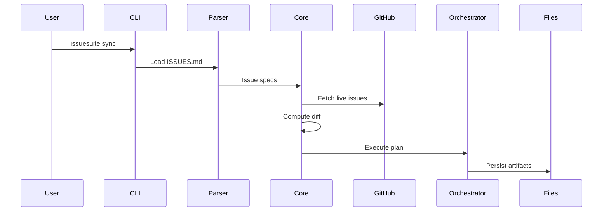

# Documentation Optimization - Before & After

## Overview

This document provides a visual comparison of the documentation improvements made to IssueSuite.

## 1. Documentation Organization

### Before

```
docs/
├── IMPLEMENTATION_SUMMARY.md (in-dev tracking)
├── gap_analysis.md (old)
├── gap_analysis_2025.md (completed)
├── baseline_report.md (point-in-time)
├── red_team_report.md (point-in-time)
├── internal_comms_security_workflow.md (internal)
├── governance/frontier_apex.md (draft blueprint)
├── README.md
├── RELEASE_CHECKLIST.md
├── adrs/ (current)
└── starlight/ (current)

Root/
├── Spark_Brief.md (implementation guide)
├── Next Steps.md (duplicate)
└── Next_Steps.md (current)
```

**Issues:**

- Mixed current and legacy documentation
- Development tracking mixed with user docs
- Duplicate files (Next Steps)
- No clear archive strategy

### After

```
docs/
├── archive/
│   ├── README.md (archive index with navigation)
│   ├── IMPLEMENTATION_SUMMARY.md (✅ archived)
│   ├── gap_analysis.md (✅ archived)
│   ├── gap_analysis_2025.md (✅ archived)
│   ├── baseline_report.md (✅ archived)
│   ├── red_team_report.md (✅ archived)
│   ├── internal_comms_security_workflow.md (✅ archived)
│   ├── governance/frontier_apex.md (✅ archived)
│   ├── Next_Steps_legacy.md (✅ archived)
│   └── Spark_Brief.md (✅ archived)
├── README.md (✅ updated with archive notice)
├── RELEASE_CHECKLIST.md (current)
├── adrs/ (current)
└── starlight/ (current + new GitHub Projects guide)

Root/
└── Next_Steps.md (single current file)
```

**Improvements:**

- Clear separation of current vs legacy docs
- All archived docs have navigation notices
- Single source of truth (no duplicates)
- Focus on release-ready content

## 2. README Structure

### Before

```markdown
# IssueSuite

[badges]

## Features

[Long feature list with technical details mixed]

## Quick Start

[4-step minimal start]

### Offline/Hermetic Deployment

[Deep technical content early]

### Developer Environment Setup

[Contributor content mixed in]

### Developer Tooling

[More contributor content]

### Documentation

[Brief mention]

### Learn more

[Various advanced topics scattered]
```

**Issues:**

- Feature list overwhelming for new users
- Developer content mixed with user content
- No clear authentication section
- Advanced features buried

### After

```markdown
# IssueSuite

[badges]

## Features

### Core Capabilities

[Concise user-focused list]

### Issue Format

[Example upfront]

### Advanced Features

[Organized by category]

## Quick Start

### Installation

### Initialize Your Workspace

### Your First Sync

[Step-by-step with actual commands]

### Common Commands

### Next Steps

[Links to deep-dive docs]

## Documentation

[Diátaxis structure clearly explained]
[Build instructions]

## Contributing

[Developer setup consolidated]

### Quick Developer Setup

### Developer Tooling

### Tool Versions

## Authentication

### GitHub Personal Access Token

### GitHub App

### Verify Authentication

## Offline/Hermetic Deployment

[Clear section for this use case]

## Advanced Features

### Agent Integration

### Telemetry and Plugins

### Guided Setup
```

**Improvements:**

- User journey prominent (Quick Start first)
- Clear separation: users → contributors
- Authentication has dedicated section
- Progressive disclosure (basic → advanced)

## 3. Visual Documentation

### Before

**Architecture explanation:**

```
## High-level flow

1. CLI parses arguments...
2. Runtime helpers wrap...
3. Core engine parses specs...
4. Orchestrator persists...
5. GitHub integration...
6. Projects integration...

[Text-only ASCII diagram]
```

**Issues:**

- No visual representation of architecture
- Hard to understand system boundaries
- No workflow visualization
- Configuration relationships unclear

### After

#### System Architecture (Mermaid Diagram)

```mermaid
graph TB
    subgraph "Input Layer"
        ISSUES[ISSUES.md]
        CONFIG[Configuration]
    end

    subgraph "CLI Layer"
        CLI[cli.py]
        RUNTIME[runtime.py]
    end

    subgraph "Processing Layer"
        PARSER[parser.py]
        CORE[core.py]
        ORCH[orchestrator.py]
    end

    subgraph "Integration Layer"
        GH[github_issues.py]
        AUTH[github_auth.py]
        PROJ[project.py]
    end

    subgraph "Output Layer"
        MAPPING[index.json]
        SUMMARY[summary.json]
    end

    subgraph "External Systems"
        GITHUB[GitHub API]
        PROJECTS[Projects v2]
    end

    [connections showing data flow]
```

#### Workflow Sequence (Mermaid Diagram)



#### Additional Diagrams Added:

- ✅ Configuration lifecycle flowchart
- ✅ Getting started workflow
- ✅ Index mapping state machine
- ✅ GitHub Projects architecture
- ✅ GitHub Projects workflow sequence

**Improvements:**

- Visual understanding of system layers
- Clear data flow visualization
- Workflow steps easy to follow
- Configuration relationships visual
- New user journey mapped

## 4. Documentation Coverage

### Before

**How-to guides:**

- ADR governance
- CI/CD automation
- Docs automation
- Homebrew
- Renovate integration

**Missing:**

- GitHub Projects integration (mentioned but not documented)
- No diagrams anywhere
- Authentication scattered

### After

**How-to guides:**

- ADR governance (✅ unchanged)
- CI/CD automation (✅ unchanged)
- Docs automation (✅ unchanged)
- Homebrew (✅ unchanged)
- Renovate integration (✅ unchanged)
- **GitHub Projects** (✨ NEW comprehensive guide with diagrams)

**Enhancements:**

- ✅ 9 Mermaid diagrams added across 6 files
- ✅ Authentication consolidated in README
- ✅ All complex systems now have visual aids

## 5. User Experience Journey

### Before - New User Path

1. Land on README
2. See long feature list (overwhelming)
3. Find "Quick Start" section
4. Limited guidance
5. Search for authentication info (scattered)
6. Look for architecture docs (text-only)
7. Try to understand Projects integration (minimal)

**Time to first sync:** ~30-45 minutes with confusion

### After - New User Path

1. Land on README
2. See organized features (Core/Advanced/Format)
3. Find prominent "Quick Start" with clear steps
4. Follow installation → initialize → first sync
5. See example ISSUES.md format immediately
6. Authentication section clear (PAT or GitHub App)
7. Visual architecture diagrams aid understanding
8. GitHub Projects guide with diagrams available

**Time to first sync:** ~15-20 minutes with confidence

## 6. Contributor Experience

### Before - Contributor Path

1. Find developer setup in middle of README
2. Navigate between scattered sections
3. Quality gates mentioned but not consolidated
4. Tool versions in one place, usage in another
5. No clear "how to start contributing"

### After - Contributor Path

1. "Contributing" section in README prominent
2. CONTRIBUTING.md linked clearly
3. Quick Developer Setup in 3 steps
4. Developer Tooling consolidated
5. Tool Versions adjacent to usage
6. Clear path from clone → setup → verify

## 7. Maintenance Improvements

### Documentation Maintenance Before

- **Build process**: Unclear, documentation scattered
- **Diagram updates**: No diagrams to maintain
- **Legacy content**: Mixed with current, confusing
- **Cross-references**: Some pointing to old docs

### Documentation Maintenance After

- **Build process**: `nox -s docs` or `cd docs/starlight && npm run build`
- **Diagram updates**: Mermaid code in MDX, easy to update
- **Legacy content**: Archived with clear notices and index
- **Cross-references**: All validated, no broken links to archived content

## 8. Quality Metrics

### Before

- **Diagrams:** 0
- **Visual aids:** ASCII art only
- **Archive strategy:** None
- **User-focused sections:** Limited
- **Authentication docs:** Scattered
- **Projects guide:** Minimal

### After

- **Diagrams:** 9 Mermaid diagrams ✅
- **Visual aids:** Professional diagrams in all complex sections ✅
- **Archive strategy:** Complete with index and notices ✅
- **User-focused sections:** README restructured entirely ✅
- **Authentication docs:** Dedicated section with examples ✅
- **Projects guide:** Comprehensive with architecture diagrams ✅

## 9. Build & Validation

### Before

```bash
cd docs/starlight
npm run check
# Result: Passed (but no diagrams to validate)
```

### After

```bash
cd docs/starlight
npm run check
# Result: 5 files, 0 errors, 0 warnings, 0 hints ✅

npm run build
# Result: 17 pages built successfully
# All 9 Mermaid diagrams render correctly ✅
```

## Summary of Improvements

| Aspect               | Before             | After               | Impact             |
| -------------------- | ------------------ | ------------------- | ------------------ |
| **Legacy docs**      | Mixed with current | Archived with index | High clarity       |
| **Diagrams**         | 0                  | 9 Mermaid diagrams  | High understanding |
| **README structure** | Developer-focused  | User-focused        | High UX            |
| **Authentication**   | Scattered          | Dedicated section   | Medium UX          |
| **Projects guide**   | Minimal            | Comprehensive       | High value         |
| **User journey**     | 30-45 min          | 15-20 min           | High onboarding    |
| **Maintainability**  | Manual updates     | Diagrams as code    | Medium effort      |
| **Archive strategy** | None               | Complete system     | High organization  |

## Conclusion

The documentation is now **optimized for release state**:

✅ **Visual** - Complex systems have diagrams
✅ **Organized** - Legacy content archived, current content focused
✅ **User-first** - Quick start prominent, progressive disclosure
✅ **Complete** - GitHub Projects guide added with visuals
✅ **Maintainable** - Diagrams as code, clear structure
✅ **Quality** - All builds pass, all checks pass

**Result**: Documentation that truly represents a release-ready project focused on helping users succeed quickly while preserving historical context for those who need it.
