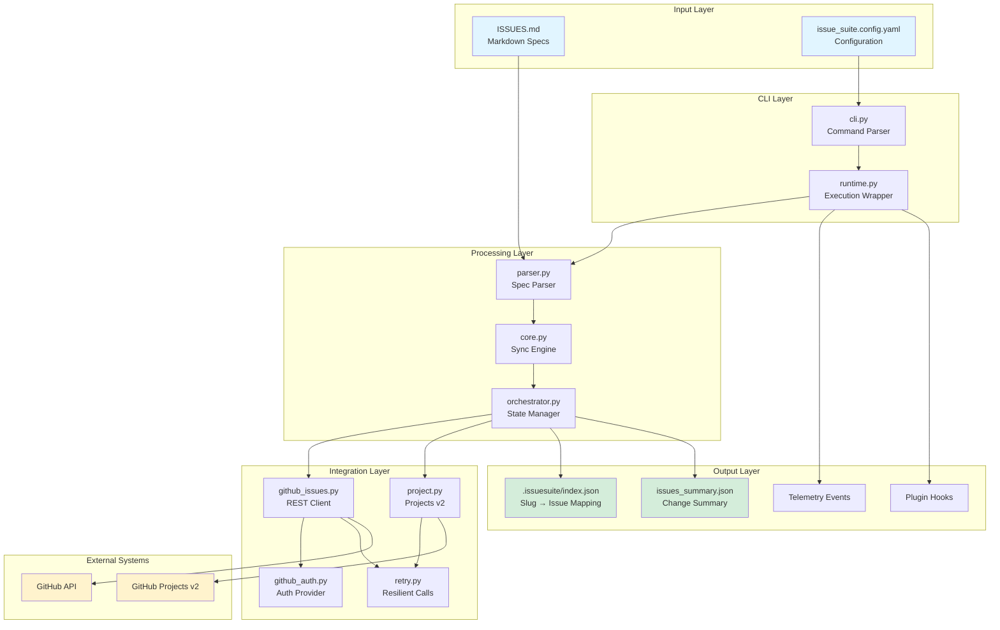
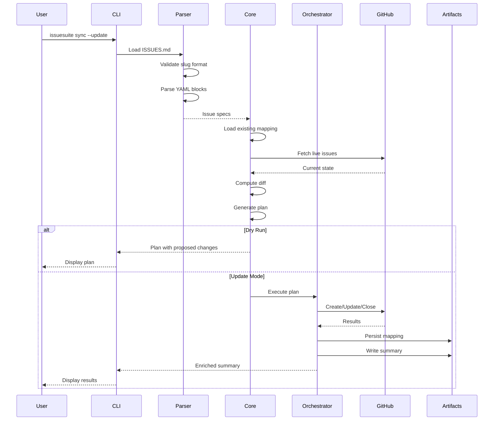
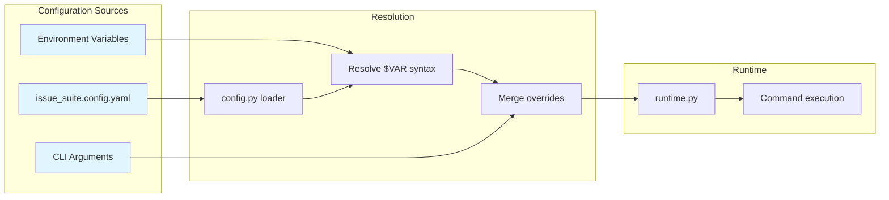

IssueSuite is a Python CLI that declaratively manages GitHub Issues from a single Markdown source of truth. This explanation summarises the core modules and data flow.

## System architecture



This diagram shows the complete data flow from Markdown specs through processing to GitHub integration and artifact generation.

## High-level flow



The sequence diagram above shows the typical sync workflow:

1. **CLI (`src/issuesuite/cli.py`)** parses arguments, loads configuration, and dispatches subcommands.
2. **Runtime helpers (`runtime.py`)** wrap command execution with telemetry emission and plugin invocation.
3. **Core engine (`core.py`)** parses specs, computes sync plans, and orchestrates GitHub mutations or mock-mode prints.
4. **Orchestrator (`orchestrator.py`)** persists mapping state, enriches summaries, and enforces diff truncation.
5. **GitHub integration (`github_issues.py`, `github_auth.py`)** centralises REST calls with resilient retries from `retry.py`.
6. **Projects integration (`project.py`)** optionally syncs into GitHub Projects v2 using cached metadata in `.issuesuite_cache/`.

```text
ISSUES.md  -> parser -> plan builder -> GitHub client
   |            |             |               |
   |            v             v               v
   +--> SuiteConfig ----> orchestrator ----> telemetry/plugins
```

## Key modules

| Module            | Responsibility                                                                 |
| ----------------- | ------------------------------------------------------------------------------ |
| `parser.py`       | Validates spec format and converts Markdown into structured issues.            |
| `core.py`         | Compares desired state with live issues and computes mutations.                |
| `orchestrator.py` | Applies the plan, updates mappings, and returns enriched summaries.            |
| `runtime.py`      | Provides `prepare_config` and `execute_command` helpers so the CLI stays thin. |
| `telemetry.py`    | Emits JSONL events when enabled, without affecting command success.            |
| `plugins.py`      | Discovers entry points/environment hooks and invokes them safely.              |
| `schemas.py`      | Generates JSON Schemas for exports and telemetry consumers.                    |
| `scaffold.py`     | Implements the `issuesuite init` scaffolder.                                   |

## Configuration lifecycle



- `config.py` resolves environment variables using `$VAR` syntax before commands execute.
- Runtime overrides (`--repo`, `--project-number`) merge into the loaded config.
- Telemetry and plugin settings propagate into runtime helpers so instrumentation is opt-in.

## Testing strategy

- Unit tests rely on mock mode (`ISSUES_SUITE_MOCK=1`) for determinism.
- CLI smoke tests exercise parsing, syncing, and schema generation end-to-end.
- Specialized suites cover parser edge cases, mapping persistence, project integration, and retry logic.

:::note[Planned features]
We're exploring first-class coverage for GitHub Projects automations so documentation will soon embed live dashboards and schema diffs generated by nightly quality gates.
:::

For deeper dives see [Extensions and plugins](./extensions) and [Index mapping design](./index-mapping-design).
