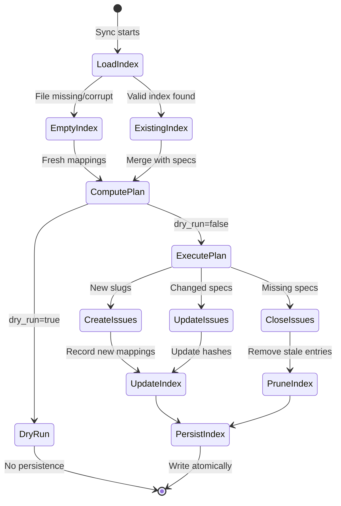

The index mapping preserves continuity between specification slugs and GitHub issue numbers.

## Purpose

Maintain a durable mapping from `external_id` (spec slug) to GitHub issue numbers so title changes or re-ordering never break updates.

## Mapping lifecycle



This state diagram shows how the index is loaded, updated during sync operations, and persisted atomically.

## File path

`.issuesuite/index.json`

## Format (version 1)

```json
{
  "version": 1,
  "generated_at": "2025-09-26T12:00:00Z",
  "repo": "<owner>/<repo>",
  "entries": {
    "api-timeouts": { "issue": 123, "hash": "abc123def4567890" }
  }
}
```

### Fields

- `version`: Schema revision (start at 1).
- `generated_at`: UTC ISO-8601 timestamp of last full write.
- `repo`: Target repository identifier (optional locally).
- `entries`: Map slug IDs to entry objects containing `issue` (int) and `hash` (truncated SHA-256).

## Lifecycle

1. Load existing index if present; start fresh on corruption.
2. After a successful non-dry-run sync update entries for created/updated specs and prune stale entries on subsequent runs.
3. Persist atomically by writing to a temp file then renaming.

## Snapshot threshold

The orchestrator emits a `mapping_snapshot` in summaries when the mapping size is below the configurable threshold (default 500). Larger mappings include size metadata only.

## Error handling

- On JSON decode errors, log a warning and treat the index as empty.
- On write failure, surface the error but do not abort the sync once results are printed.

## Future extensions

- Add `closed` boolean for retired IDs.
- Cache GitHub Project item IDs to reduce API calls.
- Merge with the hash-state file to reduce file count.

:::note[Planned features]
ADR-0001 schedules a follow-up ADR covering checksum validation and historical retention policies for large backlogs.
:::

Refer to the [ADR index](https://github.com/IAmJonoBo/IssueSuite/tree/main/docs/adrs) for the authoritative decision record.
