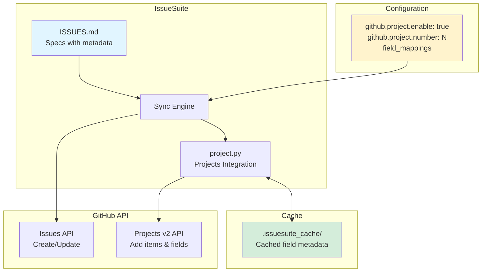
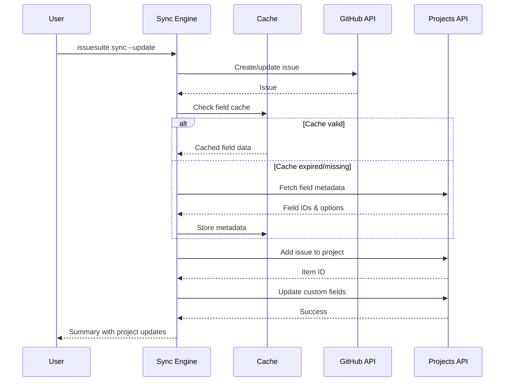

IssueSuite can automatically add created/updated issues to a GitHub Projects (v2) board and update custom fields based on your issue metadata.

## Architecture



## Prerequisites

- A GitHub Projects (v2) board in your repository or organization
- Project number (visible in project URL: `github.com/users/USER/projects/NUMBER`)
- Token or GitHub App with `project` scope
- Custom fields defined in your project (if using field mappings)

## Configuration

### Basic setup

Add to your `issue_suite.config.yaml`:

```yaml
github:
  repo: owner/repo
  project:
    enable: true
    number: 42 # Your project number
```

This adds all synced issues to the project without setting custom fields.

### Field mappings

Map issue metadata to project custom fields:

```yaml
github:
  repo: owner/repo
  project:
    enable: true
    number: 42
    field_mappings:
      Priority: priority # Map 'priority' from spec to 'Priority' field
      Status: status # Map 'status' to 'Status' field
      Sprint: milestone # Map milestone to 'Sprint' field
```

In your `ISSUES.md`:

```markdown
## [slug: api-timeout-fix]

\`\`\`yaml
title: Fix API timeout handling
priority: High
status: In Progress
milestone: Sprint 3
body: |
Implementation details...
\`\`\`
```

### Field types

Projects API supports these field types:

| Type          | Example Values          | Notes                                    |
| ------------- | ----------------------- | ---------------------------------------- |
| Single select | `High`, `Medium`, `Low` | Must match project field options exactly |
| Text          | Any string              | Free-form text                           |
| Number        | `1`, `5.5`              | Numeric values                           |
| Date          | `2025-10-15`            | ISO 8601 date format                     |
| Iteration     | `Sprint 3`              | Must match iteration name                |

## Field caching

IssueSuite caches project field metadata in `.issuesuite_cache/` to reduce API calls:

```
.issuesuite_cache/
└── project_42_fields.json
```

### Cache behavior

- **TTL**: Default 3600 seconds (1 hour)
- **Invalidation**: Automatic on TTL expiry or manual deletion
- **Configuration**:

  ```bash
  # Custom TTL
  export ISSUESUITE_PROJECT_CACHE_TTL=7200

  # Disable caching (always fetch fresh)
  export ISSUESUITE_PROJECT_CACHE_DISABLE=1
  ```

### Cache structure

```json
{
  "project_id": "PVT_kwDOAbc123",
  "fields": [
    {
      "id": "PVTF_lADOAbc123zgAbc",
      "name": "Priority",
      "dataType": "SINGLE_SELECT",
      "options": [
        { "id": "opt1", "name": "High" },
        { "id": "opt2", "name": "Medium" },
        { "id": "opt3", "name": "Low" }
      ]
    }
  ],
  "cached_at": "2025-10-10T12:00:00Z"
}
```

## Workflow



## Error handling

### Missing field options

If you specify a value not in the field's options:

```yaml
priority: Critical # But only High/Medium/Low exist
```

IssueSuite logs a warning and skips that field update:

```
WARN: Option 'Critical' not found in field 'Priority' (api-timeout-fix)
```

### Field not found

If a mapped field doesn't exist in the project:

```yaml
field_mappings:
  Nonexistent: priority
```

The sync logs an error and continues:

```
ERROR: Field 'Nonexistent' not found in project 42
```

### Permission errors

If your token lacks project access:

```
ERROR: Failed to fetch project fields: Resource not accessible by integration
```

**Solution**: Ensure token has `project` scope (classic tokens) or GitHub App has `Projects` read/write permissions.

## Troubleshooting

### Cache issues

Clear the cache and retry:

```bash
rm -rf .issuesuite_cache/
issuesuite sync --dry-run  # Refreshes cache without mutations
```

### Field mapping validation

Test field mappings with a dry-run:

```bash
issuesuite sync --dry-run --update
```

Check logs for field resolution warnings.

### Performance

For large projects (>1000 issues), enable concurrency:

```yaml
concurrency:
  enabled: true
  max_workers: 4
```

This parallelizes project API calls.

## Best practices

1. **Start with dry-run**: Always test field mappings with `--dry-run` first
2. **Cache strategy**: Use default TTL (1 hour) unless fields change frequently
3. **Field naming**: Keep field names consistent between projects for reusable configs
4. **Error monitoring**: Check logs for field mapping warnings after syncs
5. **Selective sync**: Use field mappings only for metadata that truly belongs in project views

## Examples

### Minimal project integration

```yaml
github:
  repo: myorg/myrepo
  project:
    enable: true
    number: 5
```

### Full field mapping

```yaml
github:
  repo: myorg/myrepo
  project:
    enable: true
    number: 5
    field_mappings:
      Priority: priority
      Status: status
      Sprint: milestone
      Team: team
      Estimate: estimate
```

With specs:

```markdown
## [slug: feature-x]

\`\`\`yaml
title: Implement feature X
priority: High
status: In Progress
milestone: Sprint 5
team: Backend
estimate: 5
body: |
Feature implementation...
\`\`\`
```

## Next steps

- [Configuration reference](../reference/configuration) for all project settings
- [Architecture overview](../explanations/architecture) for integration details
- [Automation CI](./automation-ci) for project sync in CI/CD
