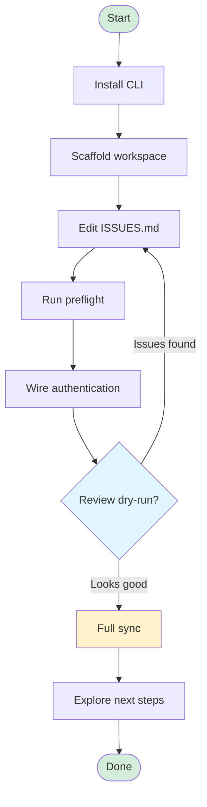

This tutorial takes you from zero to a functioning IssueSuite workspace in about ten minutes. You'll install the CLI, scaffold opinionated project assets, validate via the preflight bundle, and run a full sync once you're confident in the plan.

## Workflow overview



This flowchart shows the typical getting-started journey from installation through your first successful sync.

## Prerequisites

- Python 3.11 or newer
- A GitHub repository where IssueSuite will manage issues
- (Optional) [`pipx`](https://pypa.github.io/pipx/) for isolated CLI installs

:::caution[Upcoming automation]
We're expanding the scaffolder to emit a ready-to-run Astro Starlight workspace with your first sync so that docs publish alongside issue automation. Track progress in the documentation roadmap ADR.
:::

## 1. Install the CLI

```bash
pipx install issuesuite
# or
pip install issuesuite
```

Verify the installation:

```bash
issuesuite --help
```

## 2. Scaffold a workspace

Inside your target repository, generate IssueSuite artifacts:

```bash
issuesuite init --all-extras
```

You receive configuration, documentation, workflows, and VS Code tasks. Re-run with `--force` to overwrite or pass `--include` for specific extras.

## 3. Run a local preflight

Validate the spec, render machine-readable artifacts, and dry-run the sync:

```bash
./scripts/issuesuite-preflight.sh
```

Artifacts include `issues_summary.json` (plan totals) and `issues_plan.json` (actionable diff review). Launch the **IssueSuite: Preflight** VS Code task for a guided experience.

## 4. Wire authentication

Export a GitHub token (classic with `repo` scope or a GitHub App installation) and confirm connectivity:

```bash
issuesuite setup --check-auth
```

The doctor verifies tokens, GitHub App credentials, and mock/dry-run status so you catch environment drift early.

## 5. Promote to a full sync

Once the dry-run is clean, enable mutations:

```bash
issuesuite sync \
  --update \
  --config issue_suite.config.yaml \
  --summary-json issues_summary.json
```

Tips:

- Add `--preflight` on your first sync to auto-create labels and milestones.
- Set `behavior.dry_run_default: true` in the config if you prefer read-only by default.
- Capture plan artifacts via `--plan-json` for CI comments or auditing.

## 6. Explore next steps

- `issuesuite summary` prints a quick backlog overview.
- `issuesuite export --pretty` generates machine-friendly JSON.
- `issuesuite ai-context --preview 10` seeds assistants with structured project context.
- Continue with the [CI automation how-to](../how-to/automation-ci) and governance guides to productionise your workflow.
